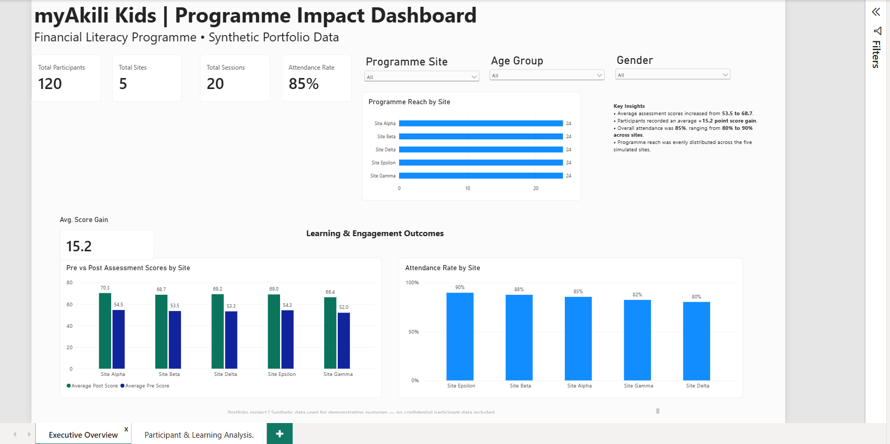
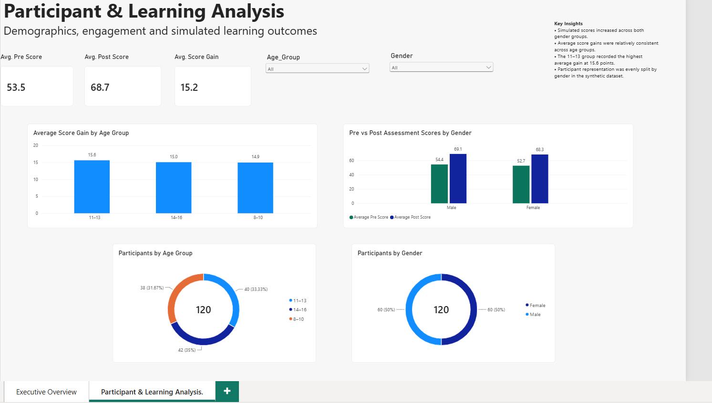

# myAkili Kids — Impact Analytics Dashboard

An end-to-end analytics portfolio project exploring programme reach, attendance, participant demographics and simulated financial literacy learning outcomes using Excel, SQL and Power BI.

> **Data Privacy Note:** This portfolio project uses entirely synthetic participant-level data created for demonstration purposes. It does not contain confidential participant information or represent measured impact results from the actual myAkili Kids programme.

---

## Project Context

myAkili Kids is a digital financial literacy programme delivered by Hitalys Consulting Services, reaching 800+ children across 5+ schools in Zambia.

This portfolio project demonstrates how programme data can be structured, analysed and visualised to support management decision-making while protecting confidential participant information.

The analytical dataset used in this repository is therefore simulated.

---

## Business Question

**How can programme data be used to understand reach, attendance, participant characteristics and changes in financial literacy assessment scores across programme sites?**

The analysis focuses on:

- Programme reach
- Session attendance and engagement
- Participant demographics
- Simulated pre- and post-assessment outcomes

---

## Project Status

- Business problem definition: Complete
- Synthetic dataset development: Complete
- Data structure & KPI framework: Complete
- SQL analysis: Developed
- Power BI dashboard: Complete
- Final insights: Complete

---

## Dashboard Preview

### Executive Overview



The Executive Overview provides a management-level view of programme reach, attendance, sessions delivered and simulated learning outcomes.

It includes:

- Total participants
- Total programme sites
- Total sessions
- Overall attendance rate
- Average score gain
- Programme reach by site
- Pre- vs post-assessment performance by site
- Attendance rate by site
- Interactive programme, age-group and gender filters

### Participant & Learning Analysis



The Participant & Learning Analysis page explores simulated learning outcomes and participant demographics.

It includes:

- Average pre-assessment score
- Average post-assessment score
- Average score gain
- Score improvement by age group
- Pre- vs post-assessment scores by gender
- Participant distribution by age group
- Participant distribution by gender
- Interactive demographic filters

---

## Dataset

A synthetic relational dataset was developed for the project using five core tables:

| Table | Purpose |
|---|---|
| Schools | Programme site information |
| Participants | Participant demographics and programme site assignment |
| Sessions | Programme session information |
| Attendance | Participant attendance by session |
| Assessments | Simulated pre- and post-assessment scores |

The portfolio dataset contains:

- **120 synthetic participants**
- **5 simulated programme sites**
- **20 programme sessions**
- **480 attendance records**

---

## Key KPIs

| KPI | Synthetic Portfolio Result |
|---|---:|
| Total Participants | 120 |
| Programme Sites | 5 |
| Sessions | 20 |
| Attendance Rate | 85% |
| Average Pre-Assessment Score | 53.5 |
| Average Post-Assessment Score | 68.7 |
| Average Score Gain | 15.2 points |

These figures are generated from the synthetic portfolio dataset and should not be interpreted as actual myAkili Kids programme results.

---

## Key Findings

Analysis of the synthetic portfolio dataset showed:

- Overall simulated attendance was **85%**.
- Site-level attendance ranged from **80% to 90%**.
- Average assessment scores increased from **53.5 to 68.7**.
- The average simulated score gain was **15.2 points**.
- Participant reach was evenly distributed across the five simulated programme sites.
- Simulated learning gains were relatively consistent across age groups.
- Both gender groups recorded higher average post-assessment scores than pre-assessment scores.
- Participant representation was evenly split by gender in the synthetic dataset.

These findings demonstrate the types of programme insights that can be generated from structured monitoring and evaluation data.

**They do not represent measured outcomes from actual myAkili Kids participants.**

---

## Analytical Approach

### Excel

Excel was used to develop and structure the synthetic relational dataset, including:

- Participants
- Programme sites
- Sessions
- Attendance records
- Assessment results
- KPI definitions

### SQL

SQL queries were developed to analyse:

- Programme reach
- Attendance
- Site-level performance
- Participant engagement
- Pre- and post-assessment outcomes
- Score improvement

The SQL files demonstrate analytical logic using techniques including:

- SELECT statements
- Aggregations
- GROUP BY
- JOINs
- CASE statements

The SQL analysis was developed as part of the portfolio project and is not presented as a deployed production database solution.

### Power BI

Power BI was used to transform the structured dataset into an interactive analytical dashboard.

The Power BI work demonstrates:

- Data modelling
- Table relationships
- DAX measures
- KPI development
- Interactive slicers
- Comparative analysis
- Executive dashboard design
- Demographic analysis
- Programme performance visualisation

---

## Tools & Skills Demonstrated

**Tools**

- Microsoft Excel
- SQL
- Microsoft Power BI
- GitHub

**Analytical Skills**

- Business problem definition
- Data structuring
- Relational data modelling
- KPI development
- Data analysis
- DAX
- SQL analysis
- Data visualisation
- Dashboard design
- Management reporting
- Insight generation

---

## Repository Structure

```text
myakili-kids-impact-dashboard/
│
├── data/
│   └── myAkili_Kids_Impact_Data.xlsx
│
├── docs/
│   └── kpi_definitions.md
│
├── sql/
│   ├── 01_programme_overview.sql
│   ├── 02_attendance_analysis.sql
│   └── 03_assessment_analysis.sql
│
├── powerbi/
│   ├── executive_overview.png
│   ├── participant_learning_analysis.png
│   ├── myAkili_Kids_Impact_Dashboard.pbix
│   └── README.md
│
└── README.md
```

---

## Project Workflow

1. Defined the programme monitoring and business questions.
2. Designed a synthetic dataset to protect confidential participant information.
3. Structured programme data in Excel.
4. Defined programme KPIs and analytical requirements.
5. Developed SQL queries for programme, attendance and assessment analysis.
6. Built a relational data model in Power BI.
7. Developed DAX measures for core programme KPIs.
8. Created an Executive Overview dashboard.
9. Created a Participant & Learning Analysis dashboard.
10. Documented findings, methodology and limitations for portfolio presentation.

---

## Limitations

This is a portfolio demonstration project.

The participant-level dataset is synthetic and was designed to demonstrate analytics techniques rather than evaluate the actual impact of the myAkili Kids programme.

The simulated results should therefore not be generalised to real programme participants or interpreted as evidence of programme effectiveness.

---

## Author

**Kateule Nkole Mwanza**

Business & Financial Analyst | Data • Strategy • Innovation

LinkedIn: linkedin.com/in/kateulenkolemwanza  
GitHub: github.com/KateuleNkole
- 30 MAY 2026: Repository created, project scoped
- 02 October 2026: Repository updated.
